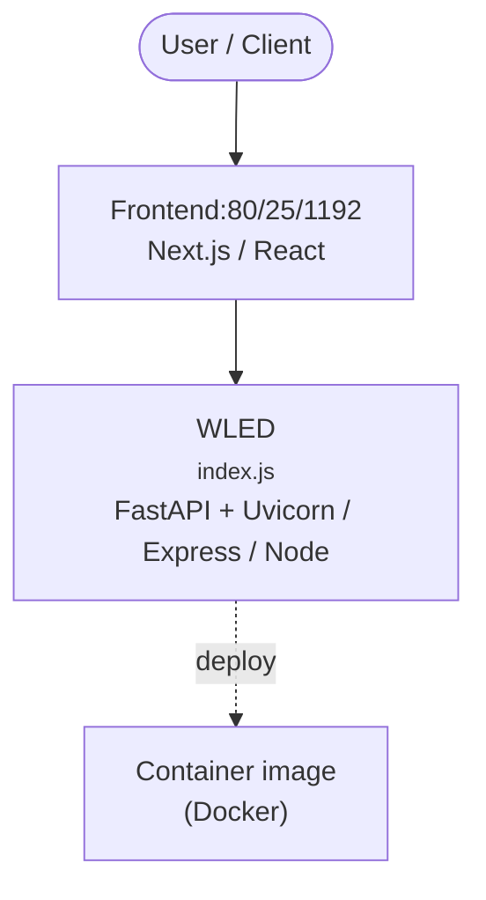

# Context Map — `WLED`

> Auto-generated architecture & deployment context map. Summarizes the core application, container/cloud footprint, and database connections. Regenerate after significant structural changes.

**Repo:** `avnit/WLED` · **Fork** · Public · Primary language: C++ · Default branch: `main` · Files: 580

**Description:** Control WS2812B and many more types of digital RGB LEDs with an ESP32 over WiFi!

## 1. Core application

Welcome to WLED! ✨

- **Frameworks / runtime:** FastAPI + Uvicorn, Express / Node, Next.js, React
- **Entry points:** `wled00/data/index.js`
- **Listens on port(s):** 80, 25, 1192, 21324

## 2. Containers & cloud applications

**Containers:**
- `.devcontainer/Dockerfile`
- `.devcontainer/devcontainer.json`
- `.gitpod.Dockerfile`

## 3. Database connections

_No database drivers or connection strings detected._

**Environment / config files:** `.envrc`

> ⚠️ Non-template env files are committed: `.envrc`. Verify no live secrets are tracked.

## 4. Architecture diagram

## 5. Security posture

- **Static scan findings:** 21 medium

| Severity | Rule | File:Line |
|---|---|---|
| medium | weak-hash | `usermods/usermod_v2_HttpPullLightControl/usermod_v2_HttpPullLightControl.cpp:65` |
| medium | js-innerhtml | `wled00/data/common.js:138` |
| medium | js-innerhtml | `wled00/data/icons-ui/demo-files/demo.js:18` |
| medium | js-innerhtml | `wled00/data/index.js:368` |
| medium | js-innerhtml | `wled00/data/index.js:426` |
| medium | js-innerhtml | `wled00/data/index.js:428` |
| medium | js-innerhtml | `wled00/data/index.js:494` |
| medium | js-innerhtml | `wled00/data/index.js:601` |

---
_Generated by repo context-mapping pass on 2026-08-13._